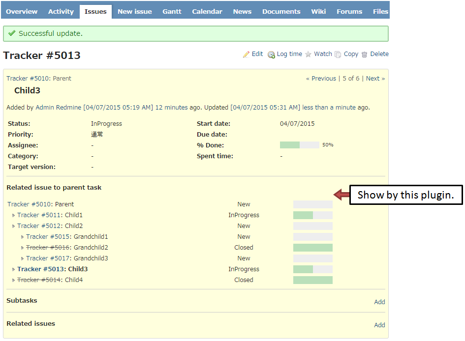

# Redmine Show Parent at Subtask
This plugin shows parent task's status at subtask.

## Compatibility
This plugin version is compatible only with Redmine 2.x.

## Installation
1. To install the plugin
    * Download files and copy the plugin directory into #{REDMINE_ROOT}/plugins.

    Or

    * Change you current directory to your Redmine root directory:  

            cd {REDMINE_ROOT}/plugins/

      Copy the plugin from GitHub using the following commands:

            git clone https://github.com/minoru-nagasawa/redmine_show_parent_at_subtask.git

2. Restart Redmine (or Apache).
